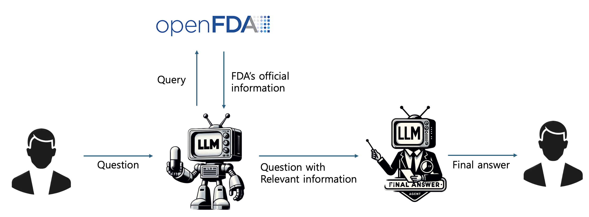

# DrugChat_openFDA

The DrugChat_openFDA is a tool designed to answer users' questions with official information from the FDA, retrieved via the openFDA API. It simplifies the process of querying the openFDA API by intelligently generating query URLs based on a user's question. This system utilizes a dual-strategy approach that combines the strengths of Retrieval-Augmented Generation (RAG) and Native GPT’s knowledge to ensure comprehensive and accurate data retrieval.


## Model Overview


### How it works

1. **Generate openFDA query**: When the user's question is submitted, the system crafts an openFDA query to find information helpful in answering the question. This query is extracted through the following Dual-Strategy Extraction:

- **Native GPT Extraction**: This method directly generates query URLs from the user's input using the function calling capabilities of ChatGPT.
- **RAG-Based Extraction**: This approach involves a more detailed analysis where the system uses few-shot prompting to extract relevant 'properties' from the context and generate 'search terms'. These terms are then used to construct URLs for querying the openFDA database. It leverages the RAG model to understand the context and identify the most relevant information for the query.

2. **Data Retrieval**: With URLs generated from both strategies, the system queries the openFDA database, retrieves data relevant to the user's question, and filters out any errors to focus on successfully returned data.

3. **Response Generation**: The retrieved data and the user's question are input into the final response agent, which is a ChatGPT model, to synthesize an informative answer.

## Getting Started

1. Installation
: Install the required dependencies by navigating to the project directory and running pip or poetry

   ```bash
   !pip install -r requirements.txt
   ```


   ```bash
   !poetry install
   ```

2. Insert API_KEY
: Open .env file and insert your OpenAI API key.
   ```bash
    OPENAI_API_KEY = "Your-OpenAI-API-Key-Here"
    OPENFDA_API_KEY = "Your-OpenAI-API-Key-Here"
   ```

3. Run the model
: Go to the folder where main.py file is located and run
   ```bash
    !python3 main.py "Your Question Here"
   ```


## Example
Here are a few example questions you might try:

> **Question**
> : "What are the side effects of aspirin?"
> 
> **Answer**
> : "Based on the relevant data extracted from the openFDA database regarding the side effects of aspirin, the known side effects include:
> 
> 1. **Allergic Reaction:** Aspirin may cause a severe allergic reaction, symptoms of which include hives, facial swelling, shock, and asthma (wheezing).
> 
> 2. **Stomach Bleeding:** The product contains an NSAID, which may cause severe stomach bleeding, especially in people who:
>    - Are aged 60 or older
>    - Have had stomach ulcers or bleeding problems
>    - Take a blood-thinning (anticoagulant) or steroid drug
>    - Take other drugs containing prescription or nonprescription NSAIDs (aspirin, ibuprofen, naproxen, or others)
>    - Have 3 or more alcoholic drinks every day while using this product
>    - Take more or for a longer time than directed
> 
> 3. **Reye's Syndrome:** Aspirin should not be used by children and teenagers who have or are recovering from chicken pox or flu-like symptoms due to the risk of Reye's syndrome, a rare but serious illness.
> 
> 4. **Other Side Effects:** Users are advised to stop use and seek medical attention if they experience any of the following signs of stomach bleeding or other side effects:
>    - Feeling faint
>    - Having bloody or black stools
>    - Vomiting blood
>    - Having stomach pain that does not get better
>    - Pain that gets worse or lasts more than 10 days
>    - Fever that gets worse or lasts more than 3 days
>    - Presence of redness or swelling
>    - Ringing in the ears or a loss of hearing occurs
>    - Occurrence of new symptoms
> 
> 5. **Pregnancy and Breastfeeding Warnings:** Pregnant or breastfeeding individuals are advised to consult a health professional before use. It is particularly important not to use aspirin during the last 3 months of pregnancy unless directed by a doctor, as it may cause problems in the unborn child or complications during delivery.
> 
> It is essential for individuals to follow the directions for use carefully and to consult a healthcare professional if any concerns or adverse effects arise while using aspirin."
---


> **Question**: "Has there been any recall on Metformin?"
> 
> **Answer**: "Yes, there has been a recall on Metformin. The recalls have been issued by various firms for reasons such as CGMP Deviations, Presence of Foreign Tablets/Capsules, Labeling issues, Defective Delivery System, and Presence of Foreign Tablets. These recalls affected numerous lots of Metformin and Metformin-containing products across different states and were classified mostly as Class II or Class III recalls. The specific reasons for recall included issues like detection of N-Nitrosodimethylamine (NDMA) impurity above the acceptable intake level, labeling mix-ups, defective delivery systems such as tablets missing laser drilling, presence of foreign substances, and packaging without inner seals."

---

> **Question**: "What adverse events are associated with Lexapro?"
> 
> **Answer**: "Based on the information extracted from the openFDA database regarding adverse events associated with Lexapro, the adverse reactions reported include:
> 
> 1. Somnolence
> 2. Trismus
> 3. Fatigue
> 
> These adverse events were observed in a patient who had been taking Lexapro for conditions such as depression and obsessive-compulsive disorder."
